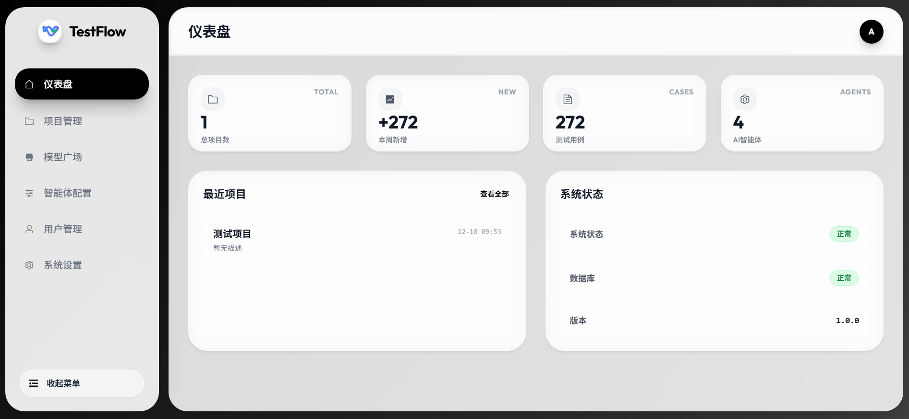
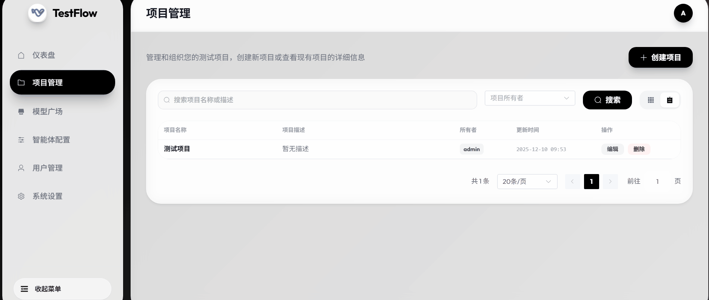
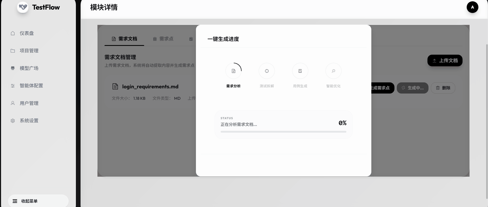

# TestFlow - 企业级模块化测试用例协作平台

<div align="center">


[](https://opensource.org/licenses/Apache-2.0)


**面向大型项目的智能化、全流程测试管理解决方案**

TestFlow 重新定义了测试用例生成方式。它不仅是一个 AI 效率工具，更是一个支持大型项目**模块化拆解**与**团队并行协作**的完整平台。通过智能体工作流，将复杂需求转化为结构化、标准化的测试资产。

[平台架构](#系统架构) • [核心特性](#核心功能) • [快速开始](#快速开始) • [适用场景](#适用场景) • [许可证](#许可证)

</div>

---



---

## 💡 项目简介

在面对成百上千个功能点的大型软件项目时，传统的“单点生成”或“文档堆砌”已无法满足需求且有着混乱的文档管理，测试点不清晰不系统。TestFlow 专为解决这一痛点而生：

- **从“工具”升级为“平台”**：提供完整的项目-模块-任务层级管理，由于 AI 处理的不仅仅是文本，而是结构化的业务逻辑。
- **模块化治理**：支持将庞大的系统拆解为独立的测试模块，每个模块拥有独立的状态流转与负责人。
- **异步生产力**：内置高性能异步任务引擎，支持后台批量处理万级用例生成任务（预期实现）。

---

## 🏗 系统架构

TestFlow 采用现代化的前后端分离架构，核心集成 **AI Agent 编排引擎** 与 **异步任务队列**，确保在处理大规模数据时的稳定性与响应速度。

![System Architecture](https://mermaid.ink/img/Z3JhcGggVEQKICAgICUlIPCfjqgg5qC35byP5a6a5LmJCiAgICBjbGFzc0RlZiB1c2VyIGZpbGw6I2UzZjJmZCxzdHJva2U6IzE1NjVjMCxzdHJva2Utd2lkdGg6MnB4LGNvbG9yOiMwZDQ3YTEscng6MTAscnk6MTA7CiAgICBjbGFzc0RlZiBmcm9udGVuZCBmaWxsOiNlOGY1ZTksc3Ryb2tlOiMyZTdkMzIsc3Ryb2tlLXdpZHRoOjJweCxjb2xvcjojMWI1ZTIwLHJ4OjUscnk6NTsKICAgIGNsYXNzRGVmIGdhdGV3YXkgZmlsbDojZmZmM2UwLHN0cm9rZTojZWY2YzAwLHN0cm9rZS13aWR0aDoycHgsY29sb3I6I2U2NTEwMCxyeDo1LHJ5OjU7CiAgICBjbGFzc0RlZiBzZXJ2aWNlIGZpbGw6I2YzZTVmNSxzdHJva2U6IzdiMWZhMixzdHJva2Utd2lkdGg6MnB4LGNvbG9yOiM0YTE0OGMscng6NSxyeTo1OwogICAgY2xhc3NEZWYgZW5naW5lIGZpbGw6I2ZmZjhlMSxzdHJva2U6I2ZmOGYwMCxzdHJva2Utd2lkdGg6M3B4LGNvbG9yOiNmZjZmMDAscng6NSxyeTo1LHN0cm9rZS1kYXNoYXJyYXk6IDUgNTsKICAgIGNsYXNzRGVmIGFpIGZpbGw6I2ZjZTRlYyxzdHJva2U6I2MyMTg1YixzdHJva2Utd2lkdGg6M3B4LGNvbG9yOiM4ODBlNGYscng6NSxyeTo1OwogICAgY2xhc3NEZWYgZGIgZmlsbDojZWNlZmYxLHN0cm9rZTojNDU1YTY0LHN0cm9rZS13aWR0aDoycHgsY29sb3I6IzI2MzIzOCxyeDo1LHJ5OjU7CiAgICBjbGFzc0RlZiBleHQgZmlsbDojZmFmYWZhLHN0cm9rZTojOWU5ZTllLHN0cm9rZS13aWR0aDoxcHgsY29sb3I6IzYxNjE2MSxzdHJva2UtZGFzaGFycmF5OiAzIDM7CgogICAgJSUg8J-RpSDnlKjmiLflsYIKICAgIFVzZXIoW_CfkaUgVXNlciAvIFFBIFRlYW1dKTo6OnVzZXIKCiAgICAlJSDwn5K7IOWJjeerr-WxggogICAgc3ViZ3JhcGggRnJvbnRlbmQgWyLwn5al77iPIFByZXNlbnRhdGlvbiBMYXllciJdCiAgICAgICAgZGlyZWN0aW9uIFRCCiAgICAgICAgc3ViZ3JhcGggRkVfQ29yZSBbIlZ1ZSAzIEFwcGxpY2F0aW9uIl0KICAgICAgICAgICAgVUlbV2ViIENvbnNvbGVdOjo6ZnJvbnRlbmQKICAgICAgICAgICAgU3RvcmVbUGluaWEgU3RhdGVdOjo6ZnJvbnRlbmQKICAgICAgICBlbmQKICAgIGVuZAoKICAgICUlIPCfm6HvuI8g572R5YWz5bGCCiAgICBzdWJncmFwaCBHYXRld2F5X0xheWVyIFsi8J-boe-4jyBBUEkgR2F0ZXdheSJdCiAgICAgICAgQVBJW0Zhc3RBUEkgUm91dGVyXTo6OmdhdGV3YXkKICAgICAgICBBdXRoW0pXVCBBdXRoXTo6OmdhdGV3YXkKICAgIGVuZAoKICAgICUlIPCfp6Ag5qC45b-D5Lia5Yqh5bGCCiAgICBzdWJncmFwaCBCdXNpbmVzc19MYXllciBbIvCfp6kgQnVzaW5lc3MgTG9naWMiXQogICAgICAgIGRpcmVjdGlvbiBUQgogICAgICAgIFByb2plY3RTdmNbUHJvamVjdCBTZXJ2aWNlXTo6OnNlcnZpY2UKICAgICAgICBNb2R1bGVTdmNbTW9kdWxlIFNlcnZpY2VdOjo6c2VydmljZQogICAgICAgIFVzZXJTdmNbVXNlciBTZXJ2aWNlXTo6OnNlcnZpY2UKICAgIGVuZAoKICAgICUlIOKaoSDlvILmraXmmbrog73lvJXmk44gKOaguOW_g-S8mOWKvykKICAgIHN1YmdyYXBoIEludGVsbGlnZW50X0VuZ2luZSBbIvCfmoAgSW50ZWxsaWdlbnQgVGFzayBFbmdpbmUgKENvcmUgQWR2YW50YWdlKSJdCiAgICAgICAgZGlyZWN0aW9uIFRCCiAgICAgICAgQXN5bmNUYXNrW-KaoSBBc3luYyBUYXNrIE1hbmFnZXJdOjo6ZW5naW5lCiAgICAgICAgUXVldWVb8J-TpSBSZWRpcy9NZW1vcnkgUXVldWVdOjo6ZW5naW5lCiAgICAgICAgCiAgICAgICAgc3ViZ3JhcGggQWdlbnRzIFsi8J-kliBBSSBBZ2VudCBQaXBlbGluZSJdCiAgICAgICAgICAgIGRpcmVjdGlvbiBMUgogICAgICAgICAgICBBMVsxLuaLhuWIhl06OjphaSAtLT4gQTJbMi7nrZbliJJdOjo6YWkKICAgICAgICAgICAgQTIgLS0-IEEzWzMu6K6-6K6hXTo6OmFpCiAgICAgICAgICAgIEEzIC0tPiBBNFs0LuS8mOWMll06OjphaQogICAgICAgIGVuZAogICAgZW5kCgogICAgJSUg8J-XhO-4jyDmlbDmja7lsYIKICAgIHN1YmdyYXBoIERhdGFfTGF5ZXIgWyLwn5K-IERhdGEgUGVyc2lzdGVuY2UiXQogICAgICAgIERCWyhTUUxpdGUgLyBQb3N0Z3JlU1FMKV06OjpkYgogICAgZW5kCgogICAgJSUg8J-UlyDpk77mjqXlhbPns7sKICAgIFVzZXIgPT0-IFVJCiAgICBVSSA8LS0-IEFQSQogICAgQVBJIC0tPiBBdXRoCiAgICBBdXRoIC0tPiBQcm9qZWN0U3ZjICYgTW9kdWxlU3ZjICYgVXNlclN2YwoKICAgICUlIOaguOW_g-a1gei9rAogICAgTW9kdWxlU3ZjIC0uLT58IlN1Ym1pdCBUYXNrInwgQXN5bmNUYXNrCiAgICBBc3luY1Rhc2sgPD09PiBRdWV1ZQogICAgUXVldWUgPT0-IEExCiAgICAKICAgICUlIEFJIOS6pOS6kgogICAgTExNW_Cfp6AgTExNIEludGVyZmFjZV06OjpleHQKICAgIEFnZW50cyAtLi0-fCJJbmZlcmVuY2UifCBMTE0KCiAgICAlJSDmlbDmja7lrZjlgqgKICAgIFByb2plY3RTdmMgJiBNb2R1bGVTdmMgJiBVc2VyU3ZjIDwtLT4gREIKICAgIEFnZW50cyA9PT58IlNhdmUgUmVzdWx0InwgREI=)

---

## 🚀 核心功能

### 1. 项目治理 (Project Governance)
* **模块化架构**：支持无限层级的“项目-模块”结构，将复杂系统化整为零。
* **分权协作**：基于模块的责任人机制 (`Assignment System`)，支持 Owner/Member 角色分工，任务责任到人。
* **状态流转**：每个模块独立管理生命周期（规划中 -> 进行中 -> 已完成），进度一目了然。


> *模块化管理：创建项目 → 添加模块 → 分配负责人 → 状态流转*

### 2. AI 生产力 (AI Productivity)
* **四阶段智能流水线**：
    1.  **需求分析**：自动解析文档，提取功能点。
    2.  **测试策划**：生成测试点与覆盖策略。
    3.  **用例设计**：输出包含详细步骤的测试用例。
    4.  **自我审查**：AI 模拟资深测试专家进行质量检查与优化。
* **批量并发生成**：利用后台异步队列，支持一次性提交数百个功能点的生成任务，无需前端等待（长期目标）。


> *AI 一键生成：从上传需求文档 → 需求拆分 → 测试点生成 → 用例设计的完整流程*

### 3. 数据与资产 (Assets Management)
* **结构化管理**：不再是散落的文档，而是数据库中结构化的测试资产。
* **双视图管理**：提供“层级树”与“列表”两种视图，满足不同的管理习惯。
* **生态互通**：支持 Excel/XMind 导入导出，无缝融入现有测试流程。


> *用例管理：层级视图/列表视图切换、搜索、批量导出*

---

## 🎯 适用场景

TestFlow 并非为了替代简单的 Excel 表格，而是为了解决复杂性而生：

*   **大型复杂系统**：面对上千个功能点、多层级模块的复杂业务系统。
*   **跨团队协作**：开发与测试团队通过统一平台进行资产沉淀与流转。
*   **敏捷迭代开发**：需要跟随两周一迭代的快节奏，快速更新回归测试用例。
*   **标准化设计规范**：希望建立统一的测试用例设计规范与质量标准的企业。

---

## 为什么选择 TestFlow？

| 特性 | 传统方式 | TestFlow |
|------|---------|----------|
| 用例生成 | 手动编写，耗时数天 | AI 自动生成，分钟级完成 |
| 项目管理 | 文档分散，难以维护 | 模块化管理，结构清晰 |
| 团队协作 | 文件传递，版本混乱 | 多用户协作，权限管理 |
| 测试覆盖 | 依赖个人经验，易遗漏 | AI 智能分析，覆盖全面 |
| 可扩展性 | 固定流程，难以定制 | 高度可配置，灵活适配 |
| 大规模处理 | 手动操作，效率低下 | 批量并发，高效处理 |

## 🛠 技术栈

### Backend (后端)
- **Core**: Python 3.8+, FastAPI
- **Database**: SQLite (SQLAlchemy ORM)
- **AI Integration**: OpenAI Compatible API (支持 GPT-4, Claude, 通义千问等)
- **Task Queue**: BackgroundTasks

### Frontend (前端)
- **Core**: Vue 3, TypeScript, Vite
- **UI Framework**: Element Plus
- **Styling**: Tailwind CSS
- **State Management**: Pinia

## 🚀 快速开始

### 环境要求
- Python 3.8+
- Node.js 16+
- Git

### 1. 克隆项目
```bash
git clone https://github.com/Ggbond626/testflow.git
cd testflow
```

### ⚡ 一键启动 (推荐)

**Windows:**
双击运行根目录下的 `run.bat` 脚本，或在命令行运行：
```bash
.\run.bat
```

**Linux / macOS:**
```bash
chmod +x run.sh stop.sh
./run.sh
```


### 📦 手动安装 (可选)

如果你更喜欢手动控制每一步，可以参考以下步骤：

#### 1. 后端设置
```bash
cd backend
python -m venv venv
# Windows
venv\Scripts\activate
# Linux/Mac
source venv/bin/activate

pip install -r requirements.txt
cp .env.example .env
```

#### 2. 前端设置
```bash
cd ../frontend
npm install
```

#### 3. 启动服务
```bash
# 启动后端
cd ../backend
uvicorn main:app --reload --port 9000

# 启动前端
cd ../frontend
npm run dev
```

访问 http://localhost:3000 即可开始使用 TestFlow。

### 🐳 Docker 部署 (推荐生产环境)

使用 Docker 可以快速部署，无需配置 Python 和 Node.js 环境。

```bash
# 1. 配置环境变量
cp backend/.env.example backend/.env

# 2. 启动服务
docker-compose up -d --build

# 3. 访问应用
# 前端: http://localhost:3000
# 后端: http://localhost:9000/docs
```

详细的 Docker 部署说明请查看 [DOCKER.md](DOCKER.md)

## 📄 许可证

## 📄 开源协议

本项目采用 **Apache 2.0** 协议开源。

*   ✅ **完全免费**：无论是个人开发者还是企业团队，均可免费用于商业或非商业项目。
*   ✅ **二次开发**：允许您基于代码进行修改、分发或集成。
*   ℹ️ **唯一限制**：在分发或衍生产品中，必须保留原始协议声明与作者署名。

我们相信开源的力量。希望TestFlow 对您有所帮助！

---

## ⭐ Star History

<a href="https://star-history.com/#Ggbond626/testflow&Date">
 <picture>
   <source media="(prefers-color-scheme: dark)" srcset="https://api.star-history.com/svg?repos=Ggbond626/testflow&type=Date&theme=dark" />
   <source media="(prefers-color-scheme: light)" srcset="https://api.star-history.com/svg?repos=Ggbond626/testflow&type=Date" />
   
 </picture>
</a>

---

<div align="center">

**⭐ 如果这个项目对你有帮助，请给个Star支持一下！**

Made with ❤️ by [Ggbond626](https://github.com/Ggbond626)

</div>
